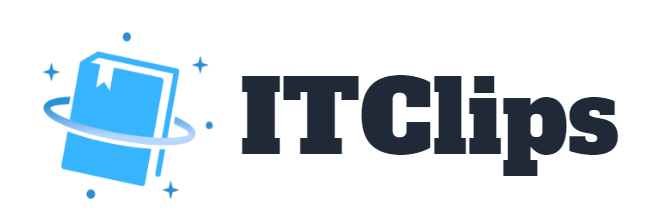
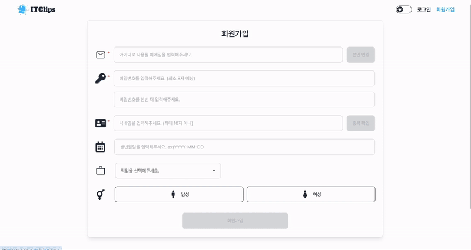
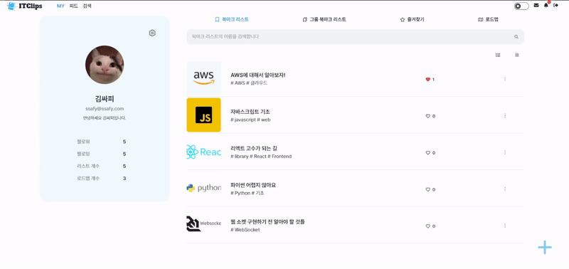
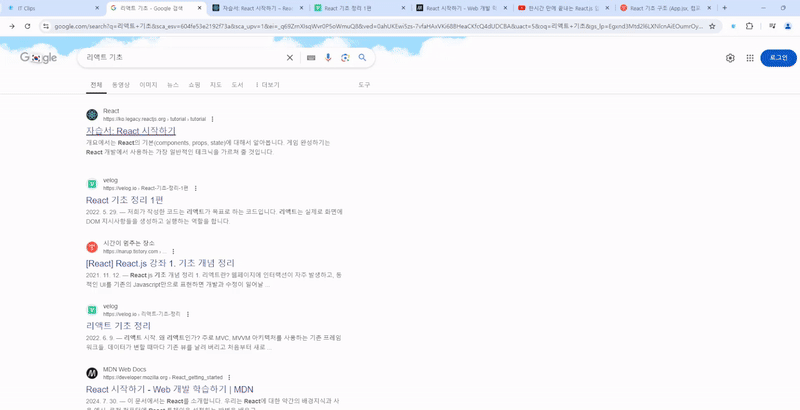
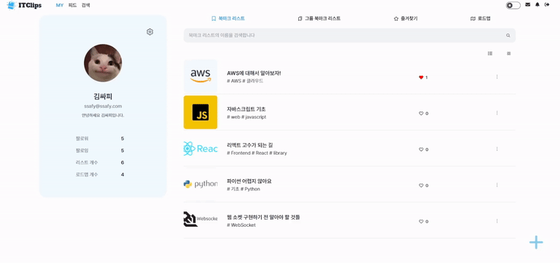
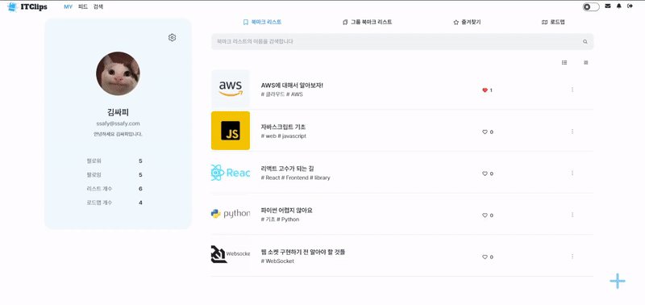
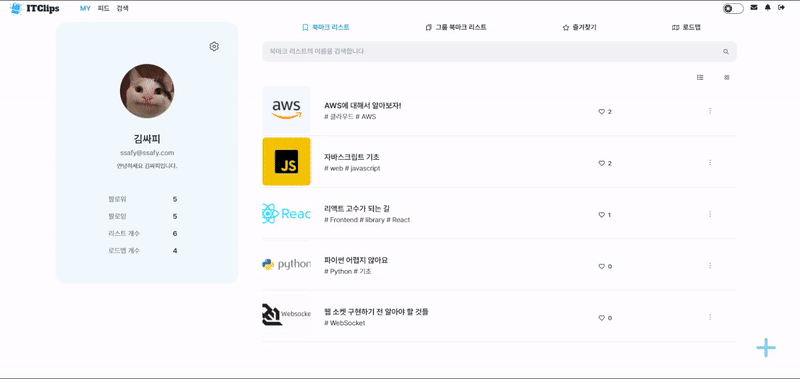

# 북마크 기반 큐레이션 SNS 서비스, < IT Clips > 
SSAFY 11기 공통 PJT / 구미 2반 5조 웹디자인<br/>
2024.07.08 ~ 2024.08.16 (6주)

🔗 **서비스 페이지 : [ITClips](https://i11d205.p.ssafy.io/)<br/>**
🔗 **서비스 소개 영상 : [[SSAFY 11기]공통 PJT "ITClips" UCC](https://www.youtube.com/watch?v=Yu8Oso7qV_k)<br/>**
🔗 **Chrome extension : 검수중...**


# 💡 프로젝트 소개

### 기획 배경

웹에서 정보를 검색할 때, 방대한 자료 속에서 필요한 정보를 찾는 것이 힘들었던 적이 있나요?<br/>
또, 이미 찾아놓은 자료들을 정돈하고 관리하는 데 어려움을 겪은 적도 있지 않나요?<br/>

웹에서 유용한 자료를 찾았지만, 그 자료를 어떻게 보관하고 정리해야 할지 막막했던 적이 있죠.<br/>
비슷한 관심사를 가진 사람들과 자료를 공유하고, 그들과의 의견을 교환하고 싶었던 순간이 있었을 것입니다.<br/>
검색한 자료들을 더욱 효율적으로 활용하고 싶지만, 방법을 찾기 어려운 경우도 있었을 것입니다.<br/>

이 모든 문제를 해결해주는 **북마크 기반 큐레이팅 SNS, ITClips✨**를 소개합니다!

**ITClips** 는 단순한 북마크 관리 이상의 가치를 제공합니다.<br/>
사용자가 찾은 유용한 자료를 쉽게 정리하고, 다른 사람들과 서로 공유하고 소통합니다. <br/>
정보의 바다 속에서 내 검색의 끝이 다른 사람의 검색의 시작이 되는, 스마트한 큐레이션 환경을 제공합니다.

***

### 서비스 소개
> 내 검색의 끝이 다른 사람의 검색의 시작이 된다.<br/>
**✨북마크 기반의 큐레이션 SNS✨**

- 나만의 효율적인 북마크 관리
- 타인과의 북마크 공유와 소통
- 북마크를 커스텀한 로드맵 생성 및 활용

<br/>

# 🔖 프로젝트 산출물
✔ [요구사항 명세서](https://docs.google.com/spreadsheets/d/1MxifEoveWd3QkiqTpQH4cVVLBofKv4JaFPL32TllpMg/edit?gid=704927790#gid=704927790)

✔ [기능 정의서](https://roomy-wing-ac0.notion.site/c413377a4b284b05a9ebf4b97f61e534?v=f5ef68d65e42461ca80757e30cf1442d&pvs=4)

✔ [API 명세서](https://roomy-wing-ac0.notion.site/API-777ba761ca934cc8a2d8fabed37df127?pvs=4)

✔ [와이어 프레임](https://www.figma.com/design/WwBvVhZq92ZsOfiNsu42KN/ItClips?node-id=0-1&t=VLLGrth3l7kKRfJH-1)

✔ [E-R Diagram](https://www.erdcloud.com/d/N4w6FLmAhKAhsXC5e)

✔ [시퀀스 다이어그램](./docs/시퀀스다이어그램.md)


✔ [E2E테스트 케이스](./docs/ITClips_테스트케이스.xlsx)


✔ [시스템 아키텍처](resources/image/시스템 아키텍처.PNG)

✔ [프로젝트 일정](https://roomy-wing-ac0.notion.site/d9124008d225496c8a5ea84790a87b8a?pvs=4)

✔ [최종 발표 자료](https://www.canva.com/design/DAGNneDhqjU/qv03xiaX13R22l2mMHaPOA/edit?utm_content=DAGNneDhqjU&utm_campaign=designshare&utm_medium=link2&utm_source=sharebutton)

✔ [포팅 매뉴얼](./exec/porting_manual.md)

✔ [시연 시나리오](./exec/scenario.md)

✔ [Swagger 문서](https://i11d205.p.ssafy.io/api/swagger-ui/index.html)

✔ [회의록](https://roomy-wing-ac0.notion.site/c26765682d60418c97b15fa0d8c71262?pvs=4)


<br/>

# 🔍 개발 환경
### Frontend
- **Node.js** 20.15.0
- **React** 18.3.1
  - **Zustand** 4.5.4
  - **React router** 6.25.1
- **TypeScript** 4.9.5
- **Axios** 1.7.2
- **Tailwind CSS** 3.4.6
  - **DaisyUI** 4.12.10
- **JWT Decode** 4.0.0
- **StompJS** 7.0.0

### Backend
- **Java OpenJDK** 17
- **Spring Boot 3.3.1** (Gradle)
  - **Spring Data JPA** / **QueryDSL**
  - **Spring Security**
  - **OAuth** 6.8.0
  - **jjwt** 0.11.2
  - **Stomp-WebSocket** 2.3.3-1
  - **SSEEmitter**
  - **Spring Data Redis**
  - **JUnit**

### CI/CD
- **AWS EC2**
  - **Ubuntu** 20.04 LTS
  - **Nginx** 1.18.0
  - **Docker** 25.0.2
  - **Jenkins** 2.443
- **AWS S3**
- **Docker Hub**

### Database
- **MySQL** 8.0.38 / **Redis** 3.3.1

### IDE
- **Visual Studio Code** 1.92.0
- **IntelliJ IDEA** 2024.1.4

### Collaboration tool
- **GitLab** / **Jira** / **Notion** / **MatterMost** / **Discord**

<br/>


# 😎 팀원

### **Platte** 팀 소개

|[정진규(팀장)](https://github.com/kkyu99)|[김민솔](https://github.com/minsol1)|[김수정](https://github.com/iamsoojung)|[김동준](https://github.com/kdj4355)|[김세진](https://github.com/tpwls30)|[최형우](https://github.com/Ysandwich)|
|:-----------------------------------------------------------------------------------------------------------------------------------------------------------------------: | :---------------------------------------------------------------------------------------: | :---------------------------------------------------------------------------------------: | :---------------------------------------------------------------------------------------: | :---------------------------------------------------------------------------------------: | :----------------------------------------------------------------------------------------: |
|  |  |  |  |  |  |
|**BE/Infra** | **Backend** | **Backend** | **Frontend**  | **Frontend** | **Frontend** |

### 팀원 역할

**FrontEnd**

- 김동준
  - UI/UX 설계
  - 소셜 로그인(Google, Github, Kakao), 일반 로그인 구현
  - NavBar, Footer, DarkMode 구현
  - AWS S3 기반 이미지 업로드 구현
  - 페이지 구현 (회원가입, 로드맵 생성/수정 DND, 피드, 서비스 소개, 피드)
- 김세진
  - UI/UX, 모바일 레이아웃 설계
  - 웹소켓 실시간 채팅 구현
  - SSE 기반 실시간 알림 구현 
  - 사이드 레이아웃 구현 (프로필, 북마크리스트, 로드맵 정보)
  - 페이지 구현 (검색, 실시간 인기순위, 프로필 설정, 팔로우 관리)
- 최형우
  - UI/UX 설계
  - 애니메이션 디자인 구현
  - 로드맵 진행도 UX 향상
  - 각종 세부 디자인
  - 페이지 구현 (북마크, 북마크리스트, 카테고리, 로드맵 상세)

**BackEnd**

- 정진규 (팀장)
  - Spring Boot 기반 서버 REST API 개발 (북마크, 북마크 리스트, 검색, 댓글 기능 등)
  - OpenAI API 기반 URL 요약 및 로드맵 추천 기능 구현
  - Redis 활용한 캐싱 및 Querydsl을 통한 성능 최적화
  - AWS S3 기반 이미지 스트리밍 구현
- 김민솔
  - Spring Boot 서버 REST API 개발 (로드맵CURD, 피드, 채팅, 알림, 랭킹)
  - STOMP 웹소켓 실시간 채팅 서버 구현
  - SSE 기반 실시간 알림 구현 
  - push model 기반 피드 구현
  - Redis 활용한 캐싱
- 김수정
  - Spring Boot 서버 REST API 개발<br/>
  (로그인/로그아웃, 회원가입 관련, 프로필 관리, JWT 재발급, 팔로우/팔로잉 모델 API)
  - OAuth2 기반 소셜 로그인(Kakao, Google, Github, Naver) 개발
  - Spring Security 적용
  - JWT 발급 개발 및 관리
  - Content-based Filtering 기반 추천 알고리즘 적용
  - Chrome Extension 프로그램 개발
  
**Infra**

- 정진규
  - 전체 시스템 아키텍처 설계
  - DockerHub 통한 서버 이미지 버전 관리
  - Jenkins 기반 CI/CD Pipeline 구축 및 FrontEnd, BackEnd 빌드/배포 자동화
  - AWS EC2 환경 설정 (Nginx, Docker, MySQL, Redis, 방화벽 설정 등)
  - LetsEncrypt 활용한 SSL 인증서 설정


<br/>

# 📚 주요 기능
### 서비스 소개 
<br/>
* ITClips를 소개하는 페이지입니다. 
<br/>
<br/>

### 회원가입
<br/>
* 회원가입 페이지입니다. 
* 회원가입 시 입력한 정보는 관심사 기반 게시글 추천에 활용됩니다. 
<br/>
<br/>

### 소셜 로그인
<br/>
* 구글, 깃허브, 카카오 로그인을 지원합니다. 
<br/>
<br/>


### 비밀번호 찾기 
<br/>
* 비밀번호를 잊어버린 경우 이메일을 통해 임시 비밀번호를 발급받을 수 있습니다. 
<br/>
<br/>

### My page
<br/>
* 자신의 프로필 정보와 북마크 리스트와 그룹 북마크 리스트 목록, 로드맵 목록, 즐겨찾기 목록을 확인할 수 있습니다. 
<br/>
<br/>

### 관심사 추가 
<br/>
* 자신의 관심사를 등록할 수 있습니다. 
* 등록한 관심사는 관심사 기반 추천에 활용됩니다. 
<br/>
<br/>

### 북마크 리스트 생성
<br/>
* 제목과 설명 사진을 입력하여 북마크 리스트를 생성할 수 있습니다. 
* 태그는 검색과 사용자 맞춤 추천에 활용됩니다. 
<br/>
<br/>

### 북마크 리스트 관리자 추가 
<br/>
* 북마크 리스트 관리자를 추가하면 그룹으로 북마크 리스트를 관리할 수 있습니다.
<br/>
<br/>

### 크롬 확장 프로그램 
<br/>
* 크롬 확장 프로그램을 통해 간편하게 북마크를 추가할 수 있습니다. 
<br/>
<br/>

### 북마크 이동
<br/>
* 북마크를 잘못 넣은 경우 간편하게 이동할 수 있습니다. 
<br/>
<br/>

### 북마크 AI 요약 
<br/>
* 북마크 AI 요약을 통해 북마크에 접속하지 않아도 내용을 알 수 있습니다. 
<br/>
<br/>

### 북마크 리스트 즐겨찾기 
<br/>
* 북마크 리스트 즐겨찾기를 등록할 수 있습니다. 
<br/>
<br/>

### 북마크 리스트 신고하기 
<br/>
* 북마크 리스트를 신고할 수 있습니다. 
<br/>
<br/>

### 로드맵 생성 
<br/>
* 북마크 리스트를 조합하여 로드맵을 생성할 수 있습니다. 
<br/>
<br/>

### 로드맵 AI 추천 생성 
<br/>
* 자신의 북마크 리스트를 기반으로 AI에게 로드맵을 추천받을 수 있습니다. 
<br/>
<br/>


### 로드맵 스크랩 
<br/>
* 다른 사용자의 로드맵을 스크랩하여 사용할 수 있습니다. 
<br/>
<br/>


### 검색 페이지 
<br/>
* 북마크리스트 제목, 로드맵 제목, 유저, 태그 검색을 할 수 있습니다. 
<br/>
<br/>

### 사용자 맞춤 추천
<br/>
* 사용자 관심사 태그와 북마크 리스트의 태그를 분석하여 사용자 맞춤 북마크 리스트를 추천합니다. 
<br/>
<br/>

### 피드
<br/>
* 팔로우한 사용자가 업로드한 게시글을 볼 수 있습니다. 
<br/>
<br/>

### 채팅 
<br/>
* 다른 사용자와 실시간 채팅이 가능합니다. 
<br/>
<br/>

### 실시간 알람 
<br/>
* 다른 사용자가 댓글, 좋아요, 스크랩, 팔로우한 경우 실시간으로 알람을 받을 수 있습니다. 
<br/>
<br/>

### 반응형 
<br/>
* 반응형 웹으로 다양한 디바이스에서 ITClips를 이용할 수 있습니다. 
<br/>
<br/>

### 다크모드 
<br/>
* 다크모드 설정이 가능합니다. 
<br/>
<br/>


# 📌 Commit Convention
```
[FEAT] 새로운 기능 구현
[FIX] 버그, 오류 수정
[DOCS] README나 WIKI 등의 문서 개정
[STYLE] 스타일 관련 기능
[REFACTOR] 코드 리팩토링
[TEST] 테스트 코드 추가
[CHORE] 빌드 업무 수정, 패키지 매니저 수정
[Comment] 필요한 주석 추가 및 변경
[Rename]  파일 또는 폴더 명을 수정하거나 옮기는 작업만인 경우 
[Remove] 파일을 삭제하는 작업만 수행한 경우
[!BREAKING CHANGE] 커다란 API 변경의 경우
[!HOTFIX] 급하게 치명적인 버그를 고쳐야 하는 경우
```
[Convention 바로가기](https://roomy-wing-ac0.notion.site/b2849f2050824dd6bcb86410f2f444a4?pvs=4)

