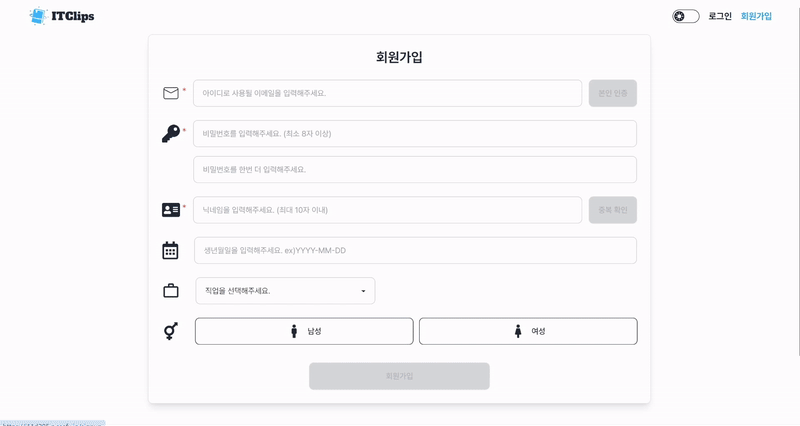
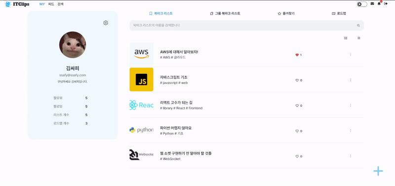
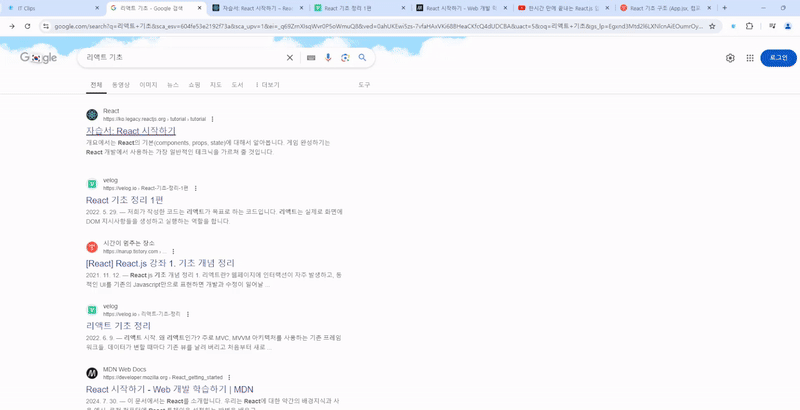
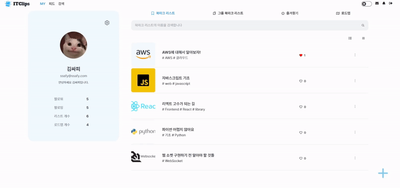
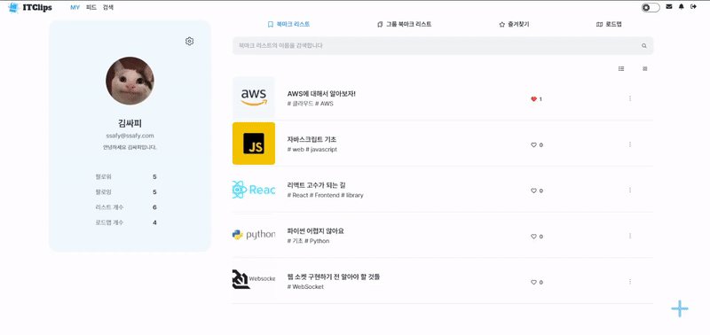
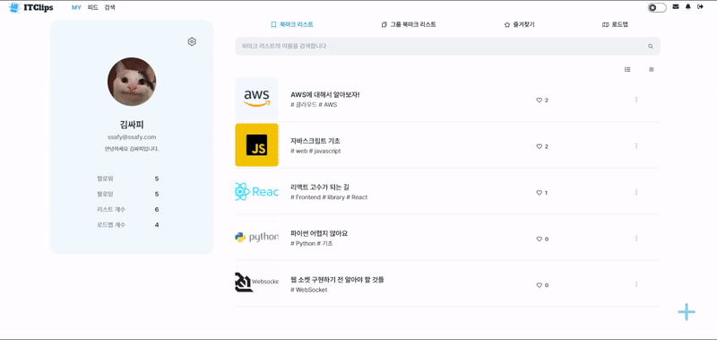

# 📚 시연 시나리오
### 서비스 소개 

* ITClips를 소개하는 페이지입니다. 
<br/>
<br/>

### 회원가입

* 회원가입 페이지입니다. 
* 회원가입 시 입력한 정보는 관심사 기반 게시글 추천에 활용됩니다. 
<br/>
<br/>

### 소셜 로그인
.gif>)
* 구글, 깃허브, 카카오 로그인을 지원합니다. 
<br/>
<br/>


### 비밀번호 찾기 

* 비밀번호를 잊어버린 경우 이메일을 통해 임시 비밀번호를 발급받을 수 있습니다. 
<br/>
<br/>

### My page

* 자신의 프로필 정보와 북마크 리스트와 그룹 북마크 리스트 목록, 로드맵 목록, 즐겨찾기 목록을 확인할 수 있습니다. 
<br/>
<br/>

### 관심사 추가 

* 자신의 관심사를 등록할 수 있습니다. 
* 등록한 관심사는 관심사 기반 추천에 활용됩니다. 
<br/>
<br/>

### 북마크 리스트 생성

* 제목과 설명 사진을 입력하여 북마크 리스트를 생성할 수 있습니다. 
* 태그는 검색과 사용자 맞춤 추천에 활용됩니다. 
<br/>
<br/>

### 북마크 리스트 관리자 추가 

* 북마크 리스트 관리자를 추가하면 그룹으로 북마크 리스트를 관리할 수 있습니다.
<br/>
<br/>

### 크롬 확장 프로그램 

* 크롬 확장 프로그램을 통해 간편하게 북마크를 추가할 수 있습니다. 
<br/>
<br/>

### 북마크 이동

* 북마크를 잘못 넣은 경우 간편하게 이동할 수 있습니다. 
<br/>
<br/>

### 북마크 AI요약 

* 북마크 AI 요약을 통해 북마크에 접속하지 않아도 내용을 알 수 있습니다. 
<br/>
<br/>

### 북마크 리스트 즐겨찾기 

* 북마크 리스트 즐겨찾기를 등록할 수 있습니다. 
<br/>
<br/>

### 북마크 리스트 신고하기 

* 북마크 리스트를 신고할 수 있습니다. 
<br/>
<br/>

### 로드맵 생성 

* 북마크 리스트를 조합하여 로드맵을 생성할 수 있습니다. 
<br/>
<br/>

### 로드맵 스크랩 

* 다른 사용자의 로드맵을 스크랩하여 사용할 수 있습니다. 
<br/>
<br/>


### 검색 페이지 

* 북마크리스트 제목, 로드맵 제목, 유저, 태그 검색을 할 수 있습니다. 
<br/>
<br/>

### 사용자 맞춤 추천

* 사용자 관심사 태그와 북마크 리스트의 태그를 분석하여 사용자 맞춤 북마크 리스트를 추천합니다. 
<br/>
<br/>

### 피드

* 팔로우한 사용자가 업로드한 게시글을 볼 수 있습니다. 
<br/>
<br/>

### 채팅 

* 다른 사용자와 실시간 채팅이 가능합니다. 
<br/>
<br/>

### 실시간 알람 

* 다른 사용자가 댓글, 좋아요, 스크랩, 팔로우한 경우 실시간으로 알람을 받을 수 있습니다. 
<br/>
<br/>

### 반응형 

* 반응형 웹으로 다양한 디바이스에서 ITClips를 이용할 수 있습니다. 
<br/>
<br/>

### 다크모드 

* 다크모드 설정이 가능합니다. 
<br/>
<br/>


# 📌 Commit Convention
```
[FEAT] 새로운 기능 구현
[FIX] 버그, 오류 수정
[DOCS] README나 WIKI 등의 문서 개정
[STYLE] 스타일 관련 기능
[REFACTOR] 코드 리팩토링
[TEST] 테스트 코드 추가
[CHORE] 빌드 업무 수정, 패키지 매니저 수정
[Comment] 필요한 주석 추가 및 변경
[Rename]  파일 또는 폴더 명을 수정하거나 옮기는 작업만인 경우 
[Remove] 파일을 삭제하는 작업만 수행한 경우
[!BREAKING CHANGE] 커다란 API 변경의 경우
[!HOTFIX] 급하게 치명적인 버그를 고쳐야 하는 경우
```
[Convention 바로가기](https://www.notion.so/b2849f2050824dd6bcb86410f2f444a4?pvs=4)

