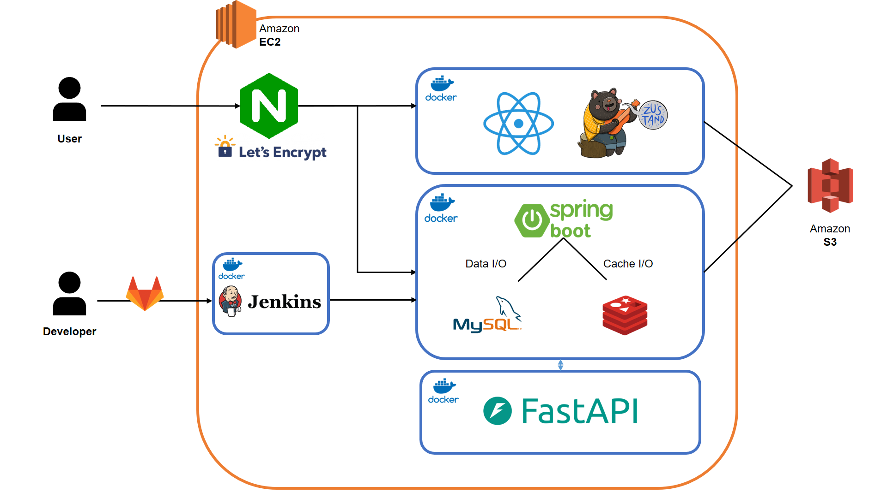

# 📚포팅 메뉴얼
### Port Number
>Port|이름
>:--|:--
>80|HTTP => 443(HTTPS)
>443|HTTPS
>3000|React, Nginx Docker Container
>3306|Mysql Docker Container
>8081|Jenkins Docker Container
>8083|FastAPI Docker Container
>8084|SpringBoot Docker Container
## 🛠기술 스택 & 버전 정보

### 1. 협업 툴


 


</br>

### 2. 개발 환경

#### **IDE**


#### **DB**


#### **UI/UX**


#### **Server**


</br>

### 3. 상세

#### **Backend**


#### **Frontend**


#### **Content-based Filtering**


#### **CI/CD**


## 🔑환경 변수

### BE
- application-secret.yml

```
jwt:
  secret: [SECRET_KEY 값]
  access:
    expiration: 3600000000
    header: Authorization
  refresh:
    expiration: 12096000000
    header: Authorization-refresh

spring:
  mail:
    host: smtp.naver.com
    port: 587
    username: [Naver 유저 아이디]
    password: [Naver 유저 비밀번호]
    properties:
      mail:
        smtp:
          auth: true
          starttls.enable: true
          connectiontimeout: 18000
          timeout: 18000
          writetimeout: 18000

  security:
    oauth2:
      client:
        registration:
          google:
            client-id: [Client 아이디]
            client-secret: [Client Secret]
            scope: [Scope 영역]

          naver:
            client-id: [Client 아이디]
            client-secret: [Client Secret]
            client-name: Naver
            redirect-uri: [Redirect URI]
            authorization-grant-type: authorization_code
            scope: [Scope 영역]

          kakao:
            client-id: [Client 아이디]
            client-secret: [Client Secret]
            client-name: Kakao
            client-authentication-method: client_secret_post
            redirect-uri: [Redirect URI]
            authorization-grant-type: authorization_code
            scope: [Scope 영역]

          github:
            client-id: [Client 아이디]
            client-secret: [Client Secret]
            redirect-uri: [Redirect URI]
            scope: [Scope 영역]
              
        provider:
          naver:
            authorization_uri: https://nid.naver.com/oauth2.0/authorize
            token_uri: https://nid.naver.com/oauth2.0/token
            user-info-uri: https://openapi.naver.com/v1/nid/me
            user_name_attribute: response
          kakao:
            authorization-uri: https://kauth.kakao.com/oauth/authorize
            token-uri: https://kauth.kakao.com/oauth/token
            user-info-uri: https://kapi.kakao.com/v2/user/me
            user-name-attribute: id


DB_HOST: [DB_HOST 주소]
DB_NAME: [DB NAME 정보]
DB_USER: [DB USER 정보]
DB_PASSWORD: [DB 비밀번호]
KEY_PASSWORD: [SSL 인증서 비밀번호]
S3_ACCESS: [S3 Access Key]
S3_PRIVATE: [S3 Private Key]
S3_BUCKET: [S3 BUCKET 이름]
GPT_KEY: [OPENAI KEY]
FAST_API_SERVER: [FAST_API SERVER 주소]

```

### FE
```
REACT_APP_LOCALHOST_URL=http://localhost:3000
REACT_APP_SERVER_URL=https://i11d205.p.ssafy.io

HTTPS=true
SSL_CRT_FILE=[SSL 인증용 .crt 파일 경로]
SSL_KEY_FILE=[SSL 인증용 .key 파일 경로]
```

## ⚙빌드 방법

### BE

1. **`server`** 프로젝트 열기
2. JDK 11 버전 확인
3. src/main/BackApplication class 실행

### FE

1. **`client`** 로 이동
2. npm install 
3. npm start
---

## 🌞Docker & Jenkins (서버 배포)



### 1. 서버 접속

```bash
# - ssafy 제공 서버 : Front, Back 서버 ( pem 키 사용 )
ssh -i [키명.pem] ubuntu@[탄련적IP/도메인 주소]
```

### 2. 기본 설정

```bash
# 방화벽 설정
sudo ufw allow 22 # ssh
sudo ufw allow 80 # http
sudo ufw allow 443 # ssl
sudo ufw allow [8084/8083/...] # 필요한 포트 번호 개방
sudo ufw enable
# 상태 확인
sudo ufw status
```

### 3. Docker 설치

```bash
sudo apt-get update
sudo apt-get install docker.io
```

### 4. MySQL 설정
```bash
sudo docker pull mysql
```

#### volume 설정
```bash
docker volume create mysql-volume

docker run -d --name mysql -e MYSQL_ROOT_PASSWORD=비밀번호 -p 3306:3306 -v mysql-volume:/var/lib/mysql mysql
```

#### mysql user 생성 및 권한 부여
```bash
//mysql 접속

docker exec -it mysql-container bash

mysql -u root -p

create user ‘유저이름’@'%' identified by ‘비밀번호’
grant all privileges on *.* to ‘유저이름’@'%';
flush privileges
```

### 5. Redis 설정
```bash
# docker container 실행 시 설정
$ docker run --name redis -p 6379:6379 -d redis --requirepass {password}

# docker 내부 접속하여 redis cli 명령을 사용하고 싶을 때
$ docker exec -it redis redis-cli -a {password}
```

### 6. Jenkins 설정

#### Jenkins 이미지 다운 & Volume 설정
```bash
// sock을 ubuntu 도커를 jenkins 컨테이너 안에서도 사용할 수 있게 설정해줌
docker run -d -p 8080:8080 -v /home/ubuntu/jenkins-data:/var/jenkins_home -v /var/run/docker.sock:/var/run/docker.sock --name jenkins jenkins/jenkins
```

#### docker.sock 권한 설정(DooD방식을 위함)
```bash
# 도커 그룹 id 찾기
getent group docker

# root 권한으로 컨테이너 접속
docker exec --user root -it jenkins bash

# docker 설치
apt-get update
apt-get install -y docker.io

# 권한 설정 - 1001이 컨테이너 외부의 docker id
sudo groupdel docker

groupadd -g 1001 docker
usermod -aG docker jenkins
(필요시) docker restart jenkins
```

### 7. SSL 설정

#### ec2 certbot 설치
```bash
# snap 설치
sudo apt-get update
sudo apt-get install snapd

# certbot 설치
sudo apt-get remove certbot
sudo snap install --classic certbot

# 인증서 발급
sudo systemctl start nginx
sudo certbot
인증서 받을 도메인 입력

# 실행하고나면 /etc/letsencrypt/live/도메인 경로로 인증 파일이 생성된다
```

#### server ssl 설정(ec2에서 발급받은 인증서 활용)
```conf
openssl pkcs12 -export -inkey privkey.pem  -in fullchain.pem -out keystore.p12
-name tomcat -CAfile chain.pem -caname root
```

```conf
server:
  ssl:
    key-store: "classpath:keystore.p12"
    key-store-type: PKCS12
    key-store-password: {위에서 작성한 비밀번호}
```


### 8. NGINX 설정

#### Nginx 설치
``` bash
# Nginx 설치
sudo apt-get install nginx
```

#### EC2 Nginx 설정

``` conf
server {
    listen 80;
    listen [::]:80;
    server_name i11d205.p.ssafy.io;

    location /api {
        proxy_pass https://127.0.0.1:8084;
        proxy_set_header X-Real-IP $remote_addr;
        proxy_set_header X-Forwarded-For $proxy_add_x_forwarded_for;
        proxy_set_header Host $host;
        proxy_set_header X-Forwarded-Proto $scheme;
   }

    location / {
        proxy_pass https://127.0.0.1:3000;
        proxy_set_header X-Real-IP $remote_addr;
        proxy_set_header X-Forwarded-For $proxy_add_x_forwarded_for;
        proxy_set_header Host $host;
        proxy_set_header X-Forwarded-Proto $scheme;
    }
}

server {
    listen 8081;
    listen [::]:8081;
    server_name i11d205.p.ssafy.io;

    location / {
        proxy_pass http://127.0.0.1:8080;  # Jenkins가 실행 중인 포트
        proxy_set_header X-Real-IP $remote_addr;
        proxy_set_header X-Forwarded-For $proxy_add_x_forwarded_for;
        proxy_set_header Host $host;
        proxy_set_header X-Forwarded-Proto $scheme;
    }
}

server {
    listen 443 ssl;
    listen [::]:443;
    server_name i11d205.p.ssafy.io;

    # SSL 인증서와 키 설정
    ssl_certificate /etc/letsencrypt/live/p.ssafy.io/fullchain.pem;
    ssl_certificate_key /etc/letsencrypt/live/p.ssafy.io/privkey.pem;
    include /etc/letsencrypt/options-ssl-nginx.conf;
    ssl_dhparam /etc/letsencrypt/ssl-dhparams.pem;

    # /api 요청을 로컬 서버의 8084 포트로 프록시
    location /api {
        proxy_pass https://127.0.0.1:8084;
        proxy_set_header X-Real-IP $remote_addr;
        proxy_set_header X-Forwarded-For $proxy_add_x_forwarded_for;
        proxy_set_header Host $host;
        proxy_set_header X-Forwarded-Proto $scheme;
    }

    # React 애플리케이션 요청을 로컬 서버의 3000 포트로 프록시
    location / {
        proxy_pass https://127.0.0.1:3000;
        proxy_set_header X-Real-IP $remote_addr;
        proxy_set_header X-Forwarded-For $proxy_add_x_forwarded_for;
        proxy_set_header Host $host;
        proxy_set_header X-Forwarded-Proto $scheme;
    }
}
```

### 9. DockerFile 생성

#### Collaborative Filtering
```Dockerfile
# 기본 이미지로 Python 3.12을 사용합니다.
FROM python:3.12.3-slim

# 작업 디렉토리를 설정합니다.
WORKDIR /home/ubuntu/filter

# 의존성 목록을 복사합니다.
COPY . /home/ubuntu/filter

# 의존성을 설치합니다.
RUN apt-get update
RUN pip install --no-cache-dir -r requirements.txt

EXPOSE 8083

# FastAPI 애플리케이션을 실행합니다.
CMD ["uvicorn", "main:app", "--host", "0.0.0.0", "--port", "8083"]
```

#### BackEnd

```Dockerfile
FROM    openjdk:17-jdk-alpine
ARG     JAR_FILE=build/libs/*.jar
COPY    ${JAR_FILE} app.jar
ENTRYPOINT ["java", "-jar", "/app.jar"]
```

#### FrontEnd
```Dockerfile
FROM nginx
WORKDIR /home/ubuntu/frontend
RUN mkdir ./build
ADD ./build ./build
RUN rm /etc/nginx/conf.d/default.conf
COPY ./nginx.conf /etc/nginx/conf.d
EXPOSE 443
CMD ["nginx", "-g", "daemon off;"]
```

- nginx.conf
```conf
server {
    listen 443 ssl;
    server_name i11d205.p.ssafy.io;

    ssl_certificate /etc/letsencrypt/archive/p.ssafy.io/fullchain1.pem;
    ssl_certificate_key /etc/letsencrypt/archive/p.ssafy.io/privkey1.pem;

    location / {
        root /home/ubuntu/frontend/build;
        index index.html index.htm;
        try_files $uri $uri/ /index.html;
    }
}
```

### 10. Jenkins pipe-line
#### 주의
- target_dir에서 properties와 같은 파일 생성 필요
```bash
vim application-secret.properties
...
```

#### BackEnd
```conf
pipeline {
    agent any

    environment {
        GIT_URL = "https://lab.ssafy.com/s11-webmobile2-sub2/S11P12D205.git"
        SOURCE_DIR = '/var/jenkins_home'
        TARGET_DIR = '/var/jenkins_home/workspace/server/server/itclips/src/main/resources'
    }

    stages {
        stage('Pull') {
            steps {
                script {
                    git url: "${GIT_URL}", branch: "BackEnd", credentialsId: 'credential'
                }
            }
        }

        stage('Copy Config Files') {
            steps {
                script {
                    // 파일 복사
                    sh "cp ${SOURCE_DIR}/application-secret.yml ${TARGET_DIR}/"
                    sh "cp ${SOURCE_DIR}/keystore.p12 ${TARGET_DIR}/"
                }
            }
        }

        stage('SpringBoot Build') {
            steps {
                script {
                    dir('server/itclips') {
                        // 실행 권한 부여
                        sh 'chmod +x ./gradlew'
                        sh './gradlew build -x test'
                    }
                }
            }
        }
        stage('Build') {
            steps {
                dir('server/itclips') {
                    sh 'docker build -t springboot .'
                }
            }
        }
        stage('Deploy') {
            steps {
                script {
                    // 실행 중인 컨테이너가 있는 경우 중지 및 제거
                    sh 'docker stop springboot && docker rm springboot'
                    // 새로운 컨테이너 실행
                    sh 'docker run -d -v /var/lib/image:/root/pictures -v /etc/timezone:/etc/timezone -v /etc/localtime:/etc/localtime --name springboot -p 8084:8084 -u root springboot'
                }
            }
        }
   
        stage('Finish') {
            steps {
                script {
                    sh 'docker images -qf dangling=true | xargs -I{} docker rmi {}'
                }
            }
        }
        
    }
}
```

#### FrontEnd
```conf
pipeline {
    agent any

    environment {
        GIT_URL = "https://lab.ssafy.com/s11-webmobile2-sub2/S11P12D205.git"
        SOURCE_DIR = '/var/jenkins_home'
        TARGET_DIR = '/var/jenkins_home/workspace/client/client/itclips'
    }
    
    tools {
        nodejs 'nodejs-20.15.1'  // 설정한 NodeJS 이름
    }

    stages {
        stage('Pull') {
            steps {
                script {
                    git url: "${GIT_URL}", branch: "Frontend", credentialsId: 'credential'
                }
            }

        }
        stage('React Build') {
            steps {
                script {
                    dir('client/itclips') {
                        sh 'npm install -g yarn'
                        sh 'CI=false yarn --cwd ./frontend install --network-timeout 100000'
                        sh 'CI=false yarn --cwd ./frontend build'
                    }
                }
            }
        }
        stage('Copy Config Files') {
            steps {
                script {
                    // 파일 복사
                    sh "cp ${SOURCE_DIR}/.env ${TARGET_DIR}/"
                    sh "cp ${SOURCE_DIR}/cert.pem ${TARGET_DIR}/"
                    sh "cp ${SOURCE_DIR}/privkey.pem ${TARGET_DIR}/"
                }
            }
        }
        stage('Build') {
            steps {
                script {
                     dir('client/itclips'){
                         sh 'docker build -t basepage/nginx .'
                     }
                    
                }
            }
        }
        stage('Deploy') {
            steps {
                script {
                    sh 'docker stop nginx && docker rm nginx'
                    sh 'docker run -d --name nginx -p 3000:443 -v /etc/letsencrypt/archive:/etc/letsencrypt/archive -u root basepage/nginx'
                }
            }
        }
        stage('Finish') {
            steps {
                script {
                    sh 'docker images -qf dangling=true | xargs -I{} docker rmi {}'
                }
            }
        }
             
    }

}
```